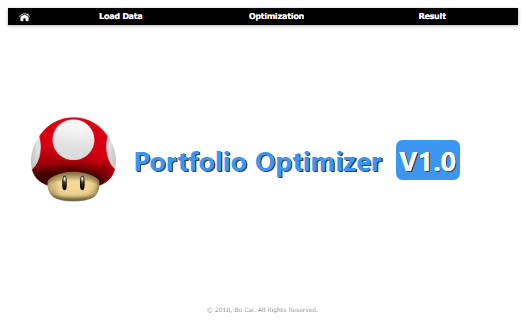
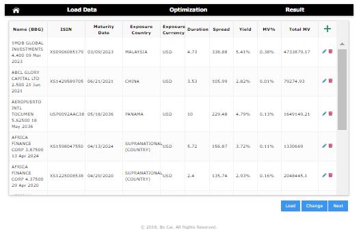
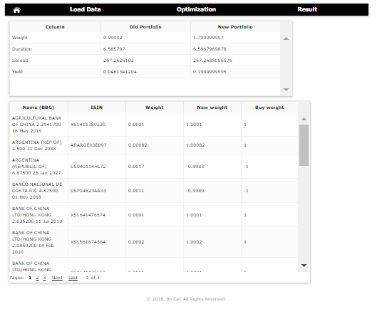

# Portfolio Optimizer (v1.0)
Sample project for Python Django framework and IBM COIN-CBC MILP solver. 

## Quickstart

Download the master repository via git clone:

`$ git clone https://github.com/bocai1011/optimizer.git`

Optionally, set up a virtualenv. Then:

`$ pip install -r requirements.txt`

Once dependencies are installed, you can start the Django development server with:

`$ python manage.py runserver`

Then, navigate to: `http://localhost:8000`

## Sample Page:

